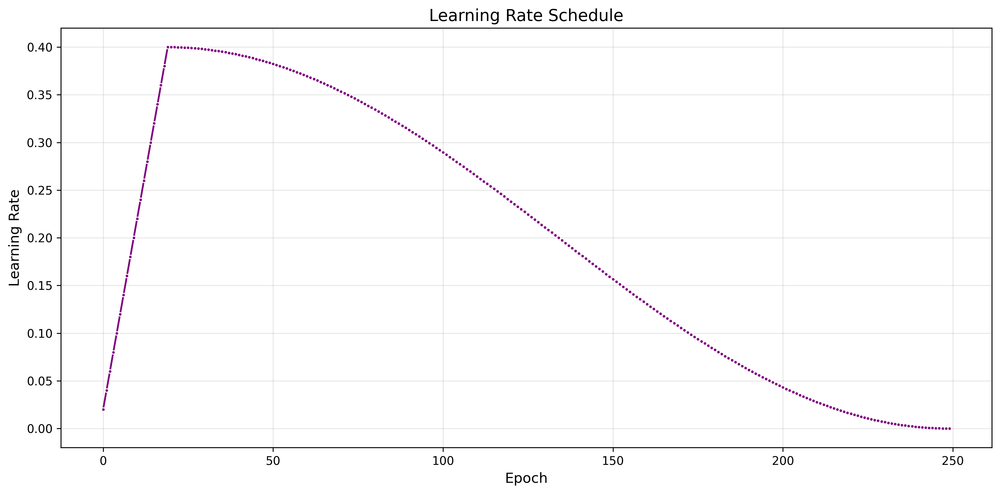

# RepVGG-Jittor-CIFAR100

## 简介

这是一个使用Jittor框架实现的RepVGG ，并在CIFAR100上进行测试，带有与Jittor实现对齐的Torch源码

## 环境配置脚本 `repo_path/env_create.sh`

**注意Jittor目前(截止到1.3.9.14版本) 对 conda支持并不完善 [点击查看issue](https://github.com/Jittor/jittor/issues/298) , 因而脚本使用venv进行环境管理** 

```bash
#!/bin/bash
sudo apt update
sudo apt install -y python3.11 python3.11-venv python3.11-dev
python3.11 -m venv repvgg 
source repvgg/bin/activate
pip install -r requirements.txt
python3.11 -m jittor.test.test_example
python3.11 -m jittor.test.test_cudnn_op
```

**如遇到Jittor自带的Cutlass库下载链接失效 [点击查看issue](https://discuss.jittor.org/t/topic/936)**
使用以下脚本修复  `repo_path/jittor_cutlass_fix.sh`

```bash
#!/bin/bash
cd ~/.cache/jittor/
mkdir cutlass
cd cutlass
wget https://cg.cs.tsinghua.edu.cn/jittor/assets/cutlass.zip
apt install unzip
unzip cutlass.zip
```


##  数据准备脚本`repo_path/train/data_loader_jittor.py`

使用 Jittor 官方提供的 `jittor.dataset.CIFAR100`

```python
import jittor as jt
import jittor.nn as nn
from jittor.dataset import ImageFolder
import jittor.transform as transform
from jittor.dataset.cifar import CIFAR100
from torchvision import transforms
from jittor import transform

def get_cifar100_dataloaders(config):
    batch_size = config['batch_size']
    img_size = config['image_size']
    
    train_transform = transform.Compose([
        transforms.RandAugment(),
        transforms.RandomCrop(32,padding=4),
        transform.Resize(img_size),
        transform.RandomHorizontalFlip(),
        transform.ToTensor(),
        transform.ImageNormalize(
            mean=[0.5071, 0.4867, 0.4408], 
            std=[0.2675, 0.2565, 0.2761]
        ),
    ])

    val_transform = transform.Compose([
        transform.Resize(img_size),
        transform.ToTensor(),
        transform.ImageNormalize(
            mean=[0.5071, 0.4867, 0.4408], 
            std=[0.2675, 0.2565, 0.2761]
        )
    ])
    
    num_workers = config['num_workers']
    
    train_dataset = CIFAR100(
        root=config['data_path'],
        train=True,
        transform=train_transform,
        download= True
    )
    
    val_dataset = CIFAR100(
        root=config['data_path'],
        train=False,
        transform=val_transform,
        download=True
    )

    train_loader = train_dataset.set_attrs(
        batch_size=batch_size, shuffle=True, num_workers=num_workers,buffer_size=1024**3)
    val_loader = val_dataset.set_attrs(
        batch_size=batch_size, shuffle=False, num_workers=num_workers,buffer_size=1024**3)

    return train_loader, val_loader 
```

## 训练脚本`/repo_path/train_all_jittor.sh`

```bash
#!/bin/bash
for config_file in model_config_yamls/*.yaml; do
    if [[ $config_file == *jittor* ]]; then
        python main_train_jittor.py --config "$config_file"
    fi
done
```

该脚本会调用 `/repo_path/main_train_jittor.py` 对 `model_config_yamls` 文件夹下默认写好的配置文件对应模型进行训练

可自定义配置，yaml配置文件样例如下:
```yaml
# 模型名称 ，随意填写
model_name : "RepVGG_Jittor_A0_cifar"
# 选择RepVGG A 或 RepVGG B架构 , 可填 "A" 或 "B"
model_type: "A"
# 卷积通道数量缩放因子
scale_a: 0.75
scale_b: 2.5
# 分组卷积分组数量
group_conv : 1
# 数据集分类类别数量 
num_classes : 100

#数据集路径
data_path : "./cifar100jittor"

#################训练参数
batch_size : 512 
image_size : 32 

epochs : 250 
lr : 0.4
weight_decay : 0.0005
momentum : 0.9
# CPU内存过小建议调小num_workers,或者在 repo_path/train/data_loader_jittor.py 中将buffer_size降低
num_workers : 12
min_lr : 0.000001 
#################训练参数

# 模型权重保存路径
chk_point_dir : ./chk_points/jittor_A0_cifar
# 训练日志保存路径
log_dir : ./logs/jittor_A0_cifar
```

## 测试脚本  `/repo_path/test_infer_all.sh`

```bash
#!/bin/bash
for config_file in model_config_yamls/*.yaml; do
    if [[ $config_file == *torch* ]]; then
        python infer_test_torch.py --config "$config_file"
    else
        python infer_test_jittor.py --config "$config_file"
    fi
done
```

该脚本会调用 `/repo_path/infer_test_jittor.py` 对 `model_config_yamls` 文件夹下所有配置文件的模型进行推理测试 ，并将测试结果保存为csv文件

该脚本默认对配置yaml文件下的 `chk_point_dir` 目录中命名为`best_model.jt`的文件进行权重加载

## 结果Log

### 模型结构

模型结构搭建遵循原作者论文[Ding, Xiaohan, et al. "Repvgg: Making vgg-style convnets great again." Proceedings of the IEEE/CVF conference on computer vision and pattern recognition. 2021.](https://arxiv.org/abs/2101.03697)

为了适应CIFAR-100数据集做出以下改动

- 将5个stage的卷积通道缩放系数[64,64,128,256,512] 更换为 [32,32,64,128,256]
- 将前两个stage的第一个RepVGG_block，卷积stride由2改为1

具体结构变为如下表所示

| Stage | Output size | RepVGG-A                | RepVGG-B                |
|-------|-------------|-------------------------|-------------------------|
| 1     | 32× 32| 1 × min(32, 32a)              | 1 × min(32, 32a)            |
| 2     | 32× 32| 2 × 32a                       | 4 × 32a                     |
| 3     | 16× 16| 4 × 64a                       | 6 × 64a                     |
| 4     | 8× 8  | 14 × 128a                     | 16 × 128a                   |
| 5     | 4 × 4 | 1 × 256b                      | 1 × 256b                    |

缩放系数a、b保持原作者设置，如下表所示

| Name       | Layers of each stage | a    | b    |
|------------|-----------------------|------|------|
| RepVGG-A0  | 1, 2, 4, 14, 1        | 0.75 | 2.5  |
| RepVGG-A1  | 1, 2, 4, 14, 1        | 1    | 2.5  |
| RepVGG-A2  | 1, 2, 4, 14, 1        | 1.5  | 2.75 |
| RepVGG-B0  | 1, 4, 6, 16, 1        | 1    | 2.5  |
| RepVGG-B1  | 1, 4, 6, 16, 1        | 2    | 4    |
| RepVGG-B1g4| 1, 4, 6, 16, 1        | 2    | 4    |

使用ResNet18作为baseline模型进行对比，使用同样方式将其5个stage的通道数改为 [32,32,64,128,256]，前两个stage卷积stride同样改为1

### 训练细节

遵循原作者使用 CosineAnnealing , Nesterov动量法

超参数
- batch_size : `512`
- epochs : `250` 
- lr : `0.4`
- weight_decay : `5e-4`
- Nesterov momentum : `0.9`
- CosineAnnealing eta_min: `1e-6`

数据增强方法包括 :
- RandAugment , `N=2,M=9`
- RandomCrop , `size=32,padding=4`
- RandomHorizontalFlip , `p=0.5`
- ImageNormalize , `mean=[0.5071, 0.4867, 0.4408], std=[0.2675, 0.2565, 0.2761]`

测试硬件环境 ： autodl云服务器

CPU : 18 vCPU AMD EPYC 9754 128-Core Processor

GPU : RTX 4090D

RAM : 60G

### Jittor框架实现:


| 模型          |   转换前参数量(M) |   转换前速度(KFPS) |   转换前准确率(%) |   转换后参数量(M) |   转换后速度(KFPS) |   转换后准确率(%) |
|:------------|------------:|--------------:|------------:|------------:|--------------:|------------:|
| RepVGG_A0   |        2.04 |         77.58 |       75.06 |        1.82 |        157.47 |       75.04 |
| RepVGG_A1   |        3.29 |         53.74 |       76.35 |        2.94 |        107.09 |       76.35 |
| RepVGG_A2   |        6.8  |         35.3  |       77.78 |        6.1  |         55.37 |       77.78 |
| RepVGG_B0   |        3.73 |         44.54 |       77.04 |        3.33 |         79.83 |       77.03 |
| RepVGG_B1   |       14    |         21.18 |       79.44 |       12.55 |         29.14 |       79.43 |
| RepVGG_B1g4 |        9.63 |         23.5  |       79.01 |        8.63 |         34.71 |       79.01 |
| resnet18    |        2.83 |         94.89 |       75.84 |        2.83 |         94.8  |       75.84 |


### Torch框架实现：
| 模型          |   转换前参数量(M) |   转换前速度(KFPS) |   转换前准确率(%) |   转换后参数量(M) |   转换后速度(KFPS) |   转换后准确率(%) |
|:------------|------------:|--------------:|------------:|------------:|--------------:|------------:|
| RepVGG_A0   |        2.03 |         60.02 |       75.65 |        1.82 |        127.86 |       75.7  |
| RepVGG_A1   |        3.27 |         44.2  |       76.27 |        2.94 |         94.59 |       76.25 |
| RepVGG_A2   |        6.78 |         25.68 |       77.38 |        6.1  |         48.42 |       77.36 |
| RepVGG_B0   |        3.71 |         31.19 |       77.04 |        3.33 |         69.36 |       76.98 |
| RepVGG_B1   |       13.96 |         12.28 |       79.75 |       12.55 |         22.99 |       79.78 |
| RepVGG_B1g4 |        9.6  |         13.07 |       78.84 |        8.63 |         26.19 |       78.83 |
| resnet18    |        2.82 |         81.57 |       75.70 |        2.82 |         81.65  |      75.70 |


### RepVGG-A0 训练过程对比

#### 损失函数变化
| Jittor框架 | PyTorch框架 |
|-----------|-------------|
|  |  |

#### 准确率变化
| Jittor框架 | PyTorch框架 |
|-----------|-------------|
|  |  |

### RepVGG-A1 训练过程对比

#### 损失函数变化
| Jittor框架 | PyTorch框架 |
|-----------|-------------|
|  |  |

#### 准确率变化
| Jittor框架 | PyTorch框架 |
|-----------|-------------|
|  |  |

### RepVGG-A2 训练过程对比

#### 损失函数变化
| Jittor框架 | PyTorch框架 |
|-----------|-------------|
|  |  |

#### 准确率变化
| Jittor框架 | PyTorch框架 |
|-----------|-------------|
|  |  |

### RepVGG-B0 训练过程对比

#### 损失函数变化
| Jittor框架 | PyTorch框架 |
|-----------|-------------|
|  |  |

#### 准确率变化
| Jittor框架 | PyTorch框架 |
|-----------|-------------|
|  |  |

### RepVGG-B1 训练过程对比

#### 损失函数变化
| Jittor框架 | PyTorch框架 |
|-----------|-------------|
|  |  |

#### 准确率变化
| Jittor框架 | PyTorch框架 |
|-----------|-------------|
|  |  |

### RepVGG-B1g4 训练过程对比

#### 损失函数变化
| Jittor框架 | PyTorch框架 |
|-----------|-------------|
|  |  |

#### 准确率变化
| Jittor框架 | PyTorch框架 |
|-----------|-------------|
|  |  |


### ResNet18 训练过程对比


#### 损失函数变化
| Jittor框架 | PyTorch框架 |
|-----------|-------------|
|  |  |

#### 准确率变化
| Jittor框架 | PyTorch框架 |
|-----------|-------------|
|  |  |

#### 学习率变化
| Jittor框架 | PyTorch框架 |
|-----------|-------------|
|  |  |